<!-- _class: title -->
# Filtros digitales

Mag. Ing. CIP Moises Meza Rodriguez

Universidad Peruana Cayetano Heredia


---

# Objetivos de la clase

- Comprender el concepto de filtrado digital
- Diferenciar FIR e IIR
- Analizar respuestas en frecuencia
- Comprender el diseño mediante ventanas
- Estudiar familias clásicas IIR
- Comprender biquads
- Entender la transformación bilineal
- Implementar filtros en Python usando SciPy

---

# Motivación

<div class="threecols">

<div class="col">

## Señales

- ECG
- EEG
- EMG
- Ultrasonido

</div>

<div class="col">

## Procesamiento

- Eliminar ruido
- Restaurar señales
- Separar espectros
- Extraer características


</div>

<div class="col">

## Aplicaciones

- Control de robots 
- Speech decoding
- Rehabilitación
- Apoyo al diagnostico

</div>

</div>

---

# Concepto de filtro

Un filtro modifica selectivamente componentes frecuenciales.
<br>

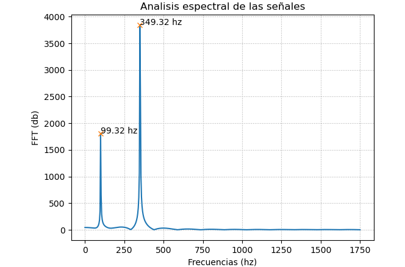

$$
x[n] \rightarrow H(z) \rightarrow y[n]
$$

<br>

- Señal original: 100hz + 350hz
- Filtro digital: lowpass
- Señal procesada: 100hz

---

# Concepto de filtro

Un filtro modifica selectivamente componentes frecuenciales.
<br>

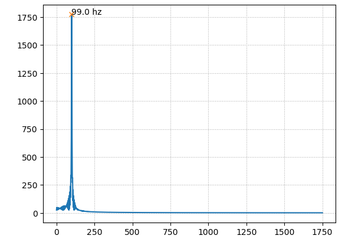

$$
x[n] \rightarrow H(z) \rightarrow y[n]
$$
<br>

- Señal original: 100hz + 350hz
- Filtro digital: lowpass
- Señal procesada: 100hz

---

# Clasificación de filtros

<br>

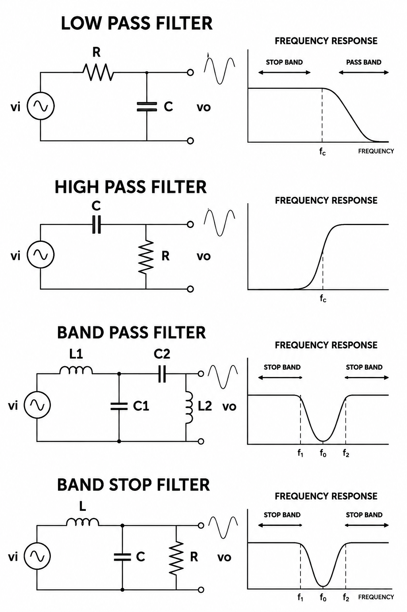

## Según respuesta frecuencial

- Pasa bajas (Low-pass)
- Pasa altas (High-pass)
- Pasa banda (Band-pass)
- Rechaza banda / Notch

---

# Filtro pasa bajas 

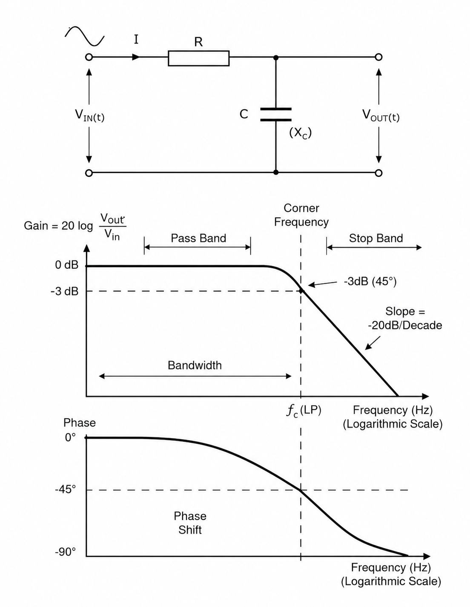

Circuito RC la salida se toma sobre el capacitor.

#### Impedancias

$$
Z_R = R
$$

$$
Z_C = \frac{1}{sC}
$$

#### Divisor de voltaje

$$
H(s)=\frac{V_{out}(s)}{V_{in}(s)}
$$

$$
H(s)=\frac{Z_C}{R+Z_C}
$$

---

# Función de transferencia


#### Simplificación

$$
H(s)=
\frac{
\frac{1}{sC}
}{
R+\frac{1}{sC}
}
$$

$$
\boxed{
H(s)=\frac{1}{1+sRC}
}
$$

#### Frecuencia de corte

$$
\omega_c=\frac{1}{RC}
$$

$$
f_c=\frac{1}{2\pi RC}
$$

---
# Respuesta en frecuencia


### Magnitud

$$
|H(j\omega)|=
\frac{1}{
\sqrt{1+(\omega RC)^2}
}
$$

### Fase

$$
\angle H(j\omega)=
-\tan^{-1}(\omega RC)
$$

---
# Código en python Low pass
```python
from scipy import signal
import numpy as np
import matplotlib.pyplot as plt
```

```python
fc=50
wc=2*np.pi*fc

num=wc
den=[1, wc]

h_s=signal.TransferFunction(num,den)  #lti
```
---
# Código en python respuesta en frecuencia
<br>

```python
w, H = signal.freqresp(h_s)    # w, mag, phase = signal.bode(h_s)
mag, phase = np.abs(H), np.angle(H)
```
 
```python
plt.figure(figsize=(10, 6))
plt.subplot(2, 1, 1)
plt.semilogx(w / (2 * np.pi), 20 * np.log10(mag))
plt.xlabel('Frecuencia [Hz]')
plt.ylabel('Magnitud [dB]')
plt.title('Respuesta en Frecuencia de H(s)')
plt.grid(True, which='both')

plt.subplot(2, 1, 2)
plt.semilogx(w / (2 * np.pi), np.degrees(phase))
plt.xlabel('Frecuencia [Hz]')
plt.ylabel('Fase [grados]')
plt.grid(True, which='both')
plt.tight_layout()
plt.show()
```

---
# Respues en frecuencia filtro pasa bajas
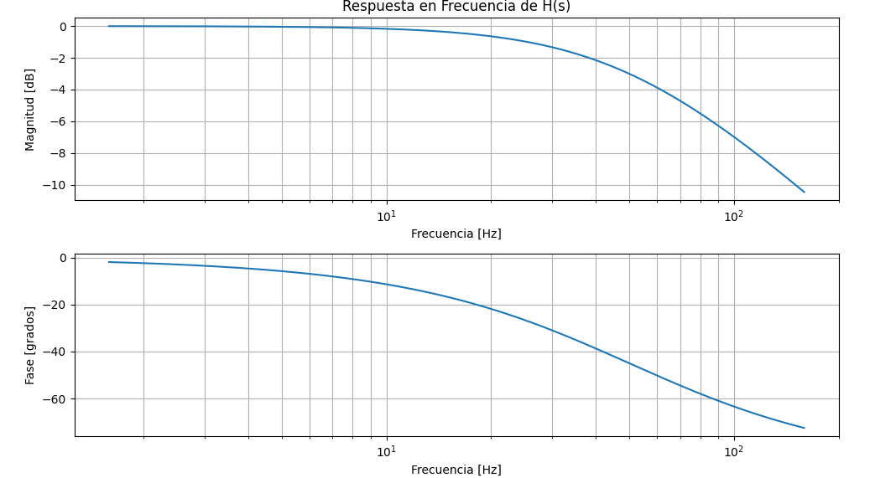

---
# Filtro pasa bajos discreto

####  Transformada Bilineal  $\hspace{0.2cm} H_{(s)} \rightarrow H_{(z)}$     

$$
s=
\frac{2}{T}
\frac{1-z^{-1}}{1+z^{-1}}
$$

donde:

- $T$ → período de muestreo
- $f_s = \frac{1}{T}$ → frecuencia de muestreo

```python
fs=1e3 # 1 khz
ts =1/fs

h_d = h_s.to_discrete(ts, method="bilinear")
```

```python
a=-h_d.den[1:]
b=h_d.num
```
---
# Código completo


[https://github.com/MSMRo/DSP_ISB/blob/main/NOTEBOOKS/2_systems/filtro_pasabajo.ipynb](https://github.com/MSMRo/DSP_ISB/blob/main/NOTEBOOKS/2_systems/filtro_pasabajo.ipynb)

---

# Filtro pasa altas

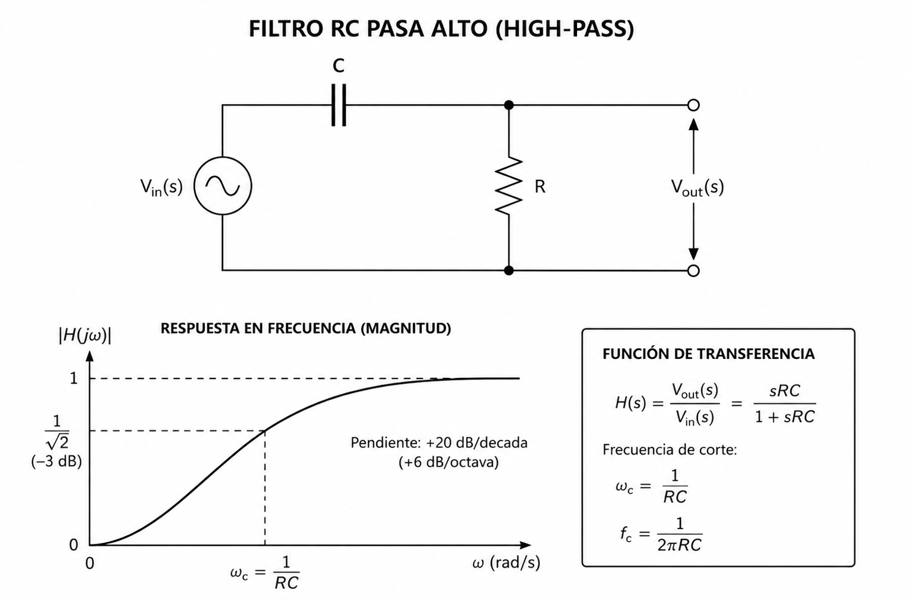

---

# Filtro pasa altas

##### Función de transferencia

$$
H(s)=\frac{sRC}{1+sRC}
\hspace{2cm}

f_{c}=\frac{1}{2\pi RC}
$$


Elimina bajas frecuencias y deja pasar altas.

```python
fc = 5                 # R = 1000      # 1 kΩ
RC = 1/(2*np.pi*fc)    # C = 1e-6      # 1 µF

num = [RC, 0]
den = [RC, 1]

system = signal.TransferFunction(num, den)
w, mag, phase = signal.bode(system)

plt.semilogx(w/(2*np.pi), mag)
plt.title("RC High Pass - Magnitude")
plt.grid()
plt.show()
```

---

# Respuesta en frecuencia

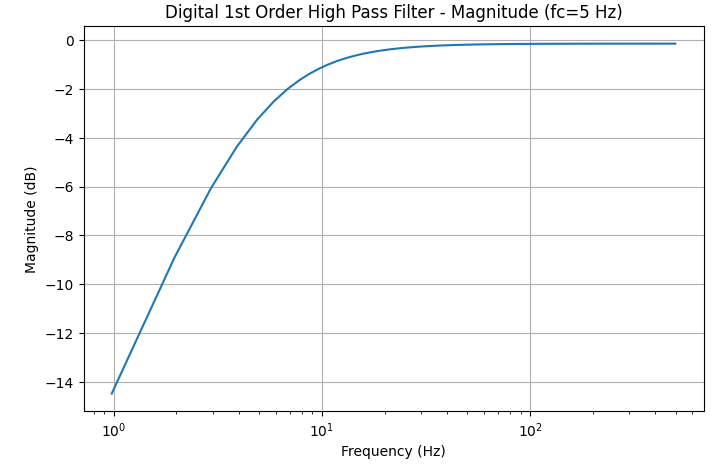

---

# Filtro pasabanda

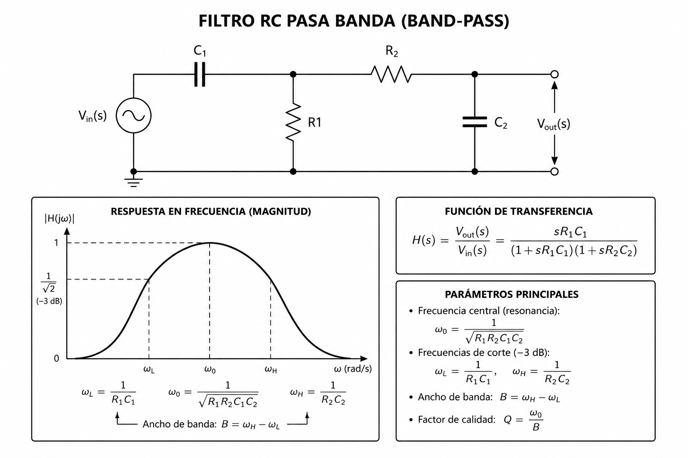

---
# Función de transferencia

$$
H(s)=\frac{sR_{1}C_{1}}{1+sR_{1}C_{1}+s^{2}R_{2}C_{2}C}
\hspace{2cm}

f_{c}=\frac{1}{2\pi RC}
$$

Elimina una banda específica.

```python
fc_hp = 5 # High-pass cutoff frequency
fc_lp = 50 # Low-pass cutoff frequency

RC_hp = 1 / (2 * np.pi * fc_hp)
RC_lp = 1 / (2 * np.pi * fc_lp)

# Numerator coefficients for H(s) = (RC_hp * s)
num = [RC_hp, 0]

# Denominator coefficients for H(s) = (RC_hp * RC_lp * s^2 + (RC_hp + RC_lp) * s + 1)
den = [RC_hp * RC_lp, RC_hp + RC_lp, 1]
```

---
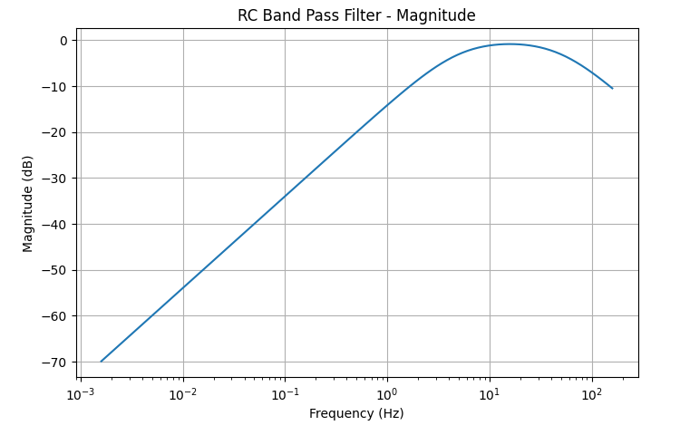


```python
system_bp = signal.TransferFunction(num, den)
w_bp, mag_bp, phase_bp = signal.bode(system_bp)

plt.figure(figsize=(8,5))
plt.semilogx(w_bp/(2*np.pi), mag_bp)
plt.title("RC Band Pass Filter - Magnitude")
plt.xlabel("Frequency (Hz)")
plt.ylabel("Magnitude (dB)")
plt.grid(True)
plt.show()
```

---

# Analógicos vs Digitales

| Analógicos | Digitales |
|---|---|
| Continuos | Discretos |
| RLC / Opamps | DSP / MCU |
| Ecuaciones diferenciales | Ecuaciones en diferencias |
| Sensibles a temperatura | Reproducibles |
| Difícil reconfiguración | Reprogramables |

---

# Convolución

#### Base del filtrado 

$$
y[n]=x[n]*h[n]
$$

$$
y[n]=\sum_{k=-\infty}^{\infty}x[k]h[n-k]
$$

---

# Respuesta al impulso

Si:

$$
x[n]=\delta[n]
$$

Entonces:

$$
y[n]=h[n]
$$

#### Importancia
Caracteriza completamente al sistema LTI.

---

# Función de transferencia

$$
H(z)=\frac{Y(z)}{X(z)}
$$

$$
H(z)=
\frac{
b_0+b_1z^{-1}+\cdots+b_Mz^{-M}
}{
1+a_1z^{-1}+\cdots+a_Nz^{-N}
}
$$

```python

```

---

# Polos y ceros

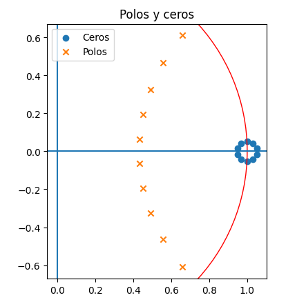

```python
z, p, k = signal.tf2zpk(b, a)
```

```python
plt.scatter(np.real(z), np.imag(z), marker='o', label='Ceros')
plt.scatter(np.real(p), np.imag(p), marker='x', label='Polos')

circle = plt.Circle((0,0), 1, color='r', fill=False)
plt.gca().add_artist(circle)

plt.axhline(0)
plt.axvline(0)
plt.gca().set_aspect('equal', 'box')
plt.legend()
plt.title('Polos y ceros')
plt.show()
```


* Ceros: Atenúan frecuencias
* Polos: Amplifican / generan resonancia
* Estabilidad: Todos los polos deben estar dentro del círculo unidad.

---

# Especificaciones de filtros

<div class="threecols">

<div class="col">

## Parámetros

- Banda pasante
- Banda rechazo
- Ripple
- Atenuación
- Banda transición

</div>

<div class="col">

# Especificaciones típicas

$$
\delta_p,\delta_s,\omega_p,\omega_s
$$

## Interpretación

- $\omega_p$ → frecuencia pasante
- $\omega_s$ → frecuencia rechazo
- $\delta_p$ → ripple pasante
- $\delta_s$ → atenuación rechazo

</div>

<div class="col">

## Consideraciones
 - menos de -20db se considera atenuado.
 - $f_{N} = \frac{f}{f_{s}}$, La frecuencia normalizada normalmente se expresa en: $0≤fn​≤0.5$
 - $f_{Nyquist}​=fs/2​​$; útil en la fft.
</div>

</div>


---

# Filtros FIR
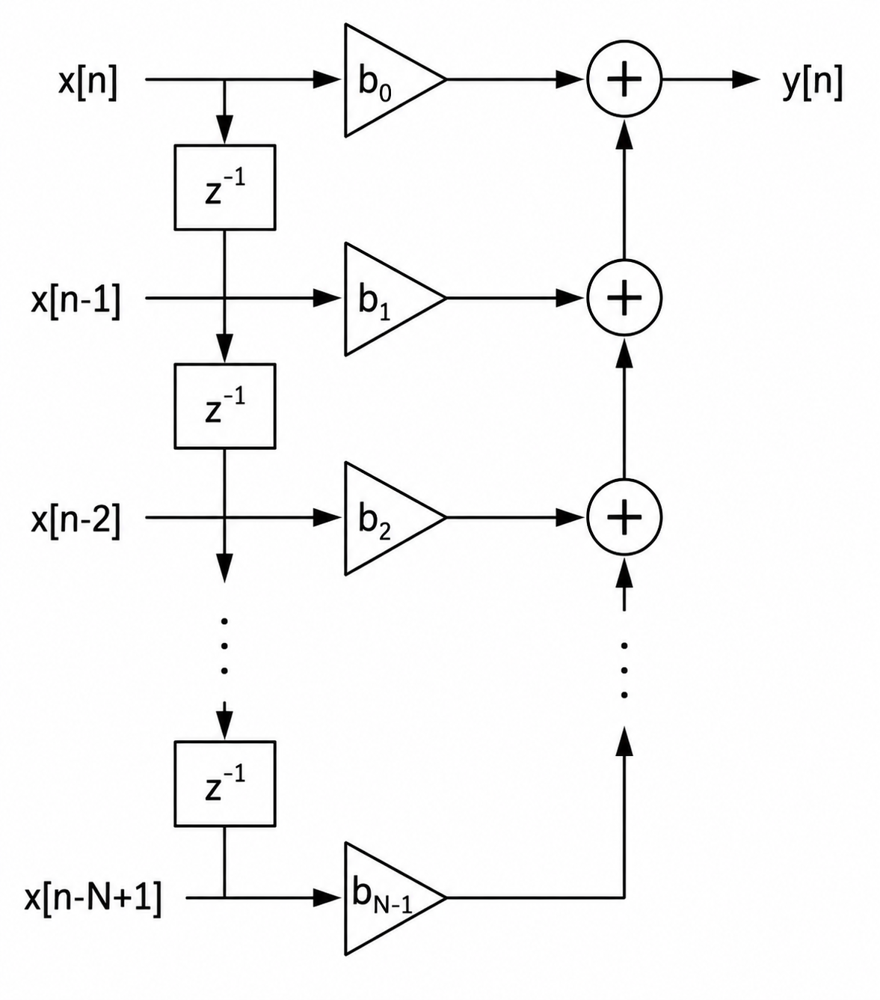
## Finite Impulse Response


$$
y[n]=\sum_{k=0}^{M}b_kx[n-k]
$$


#### Características:

- No recursivos
- Solo ceros
- Fase lineal
- Siempre estables

#### Interpretación

Promedio ponderado del pasado.

---

# Estructura FIR

<div class="threecols">

<div class="col">

## Componentes

- Delays
- Multiplicadores
- Sumadores

#### Métodos de diseño FIR

- Ventanas
- Muestreo en frecuencia
- Remez (óptimo)

</div>

<div class="col">

## Desventajas FIR

- Orden alto
- Mayor memoria
- Mayor costo computacional

## Importancia

- sistemas embebidos.
- Equipos biomédicos
</div>

<div class="col">

## Ventajas FIR

- Estabilidad garantizada
- Fase lineal
- Robustos numéricamente
- Implementación sencilla


</div>


---

# Fenómeno de Gibbs
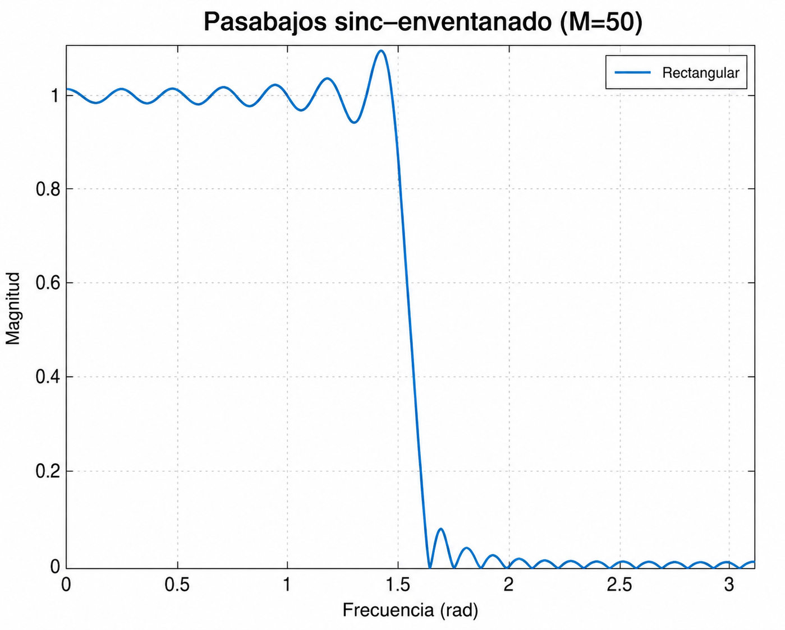
## Problema del truncamiento

Aparecen oscilaciones cerca del corte.

Consecuencias:
- Ripple
- Distorsión espectral

---

# Método de ventanas
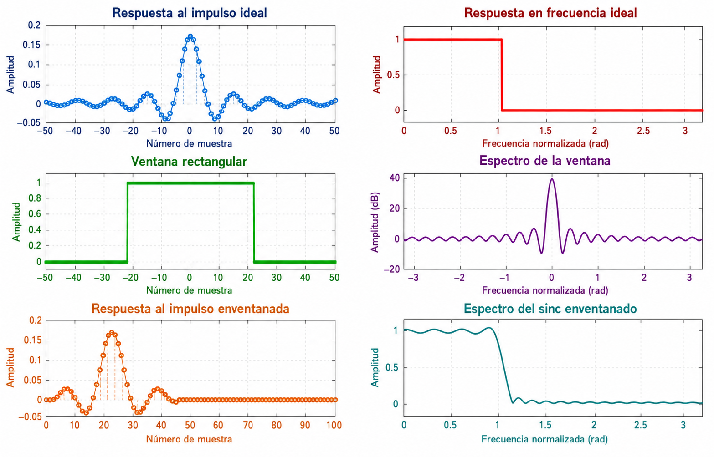

---
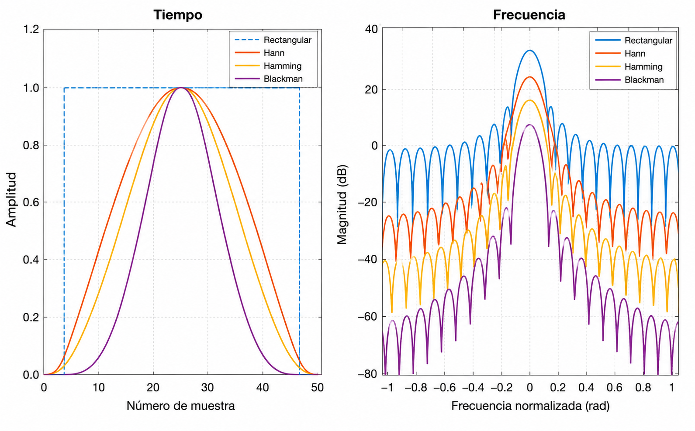

---

# Ventana rectangular
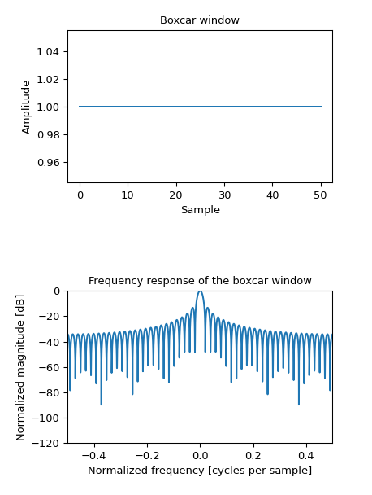
## Características

- Mainlobe estrecho
- Poor sidelobe attenuation
- Ripple elevado

```python
b = firwin(numtaps, # impar
        cutoff,  # frecuencia de corte
        window='rec', 
        pass_zero="lowpass",  
        fs=fs)
```

```python
y = lfilter(b,[1],x)
y = filtfilt(b,[1],x)
```

---

# Ventana Hann
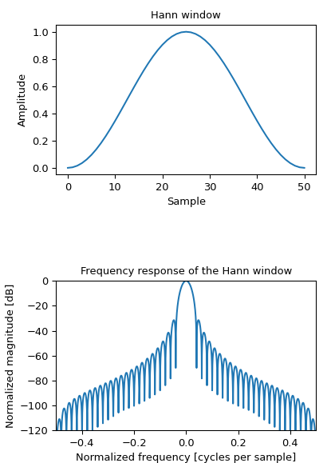
$$
w[n]=0.5-0.5\cos\left(\frac{2\pi n}{N}\right)
$$

## Características

- Buen suavizado
- Ripple moderado

```python
b = firwin(numtaps, # impar
        cutoff,  # frecuencia de corte
        window='hann', 
        pass_zero="lowpass",  
        fs=fs)
```

```python
y = lfilter(b,[1],x)
y = filtfilt(b,[1],x)
```

---

# Ventana Hamming
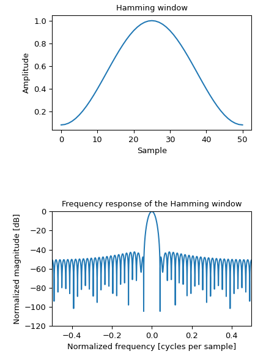
$$
w[n]=0.54-0.46\cos\left(\frac{2\pi n}{N}\right)
$$

## Características

- Muy usada
- Mejor rechazo lateral

```python
b = firwin(numtaps, # impar
        cutoff,  # frecuencia de corte
        window='hamming', 
        pass_zero="lowpass",  
        fs=fs)
```

```python
y = lfilter(b,[1],x)
y = filtfilt(b,[1],x)
```

---

# Ventana Blackman
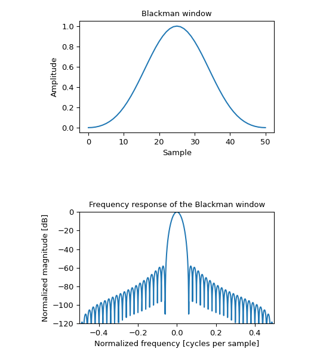
$$
w[n]=0.42-0.5\cos\left(\frac{2\pi n}{N}\right)
+0.08\cos\left(\frac{4\pi n}{N}\right)
$$

## Características

- Excelente atenuación
- Transición más ancha
- Transición

```python
b = firwin(numtaps, # impar
        cutoff,  # frecuencia de corte
        window='blackman', 
        pass_zero="lowpass",  
        fs=fs)
```

```python
y = lfilter(b,[1],x)
y = filtfilt(b,[1],x)
```

---

# Comparación de ventanas
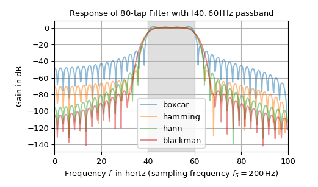
| Ventana | Ripple | Atenuación |
|---|---|---|
| Rectangular | Alto | Baja |
| Hann | Medio | Media |
| Hamming | Bajo | Alta |
| Blackman | Muy bajo | Muy alta |

---

# Filtros IIR
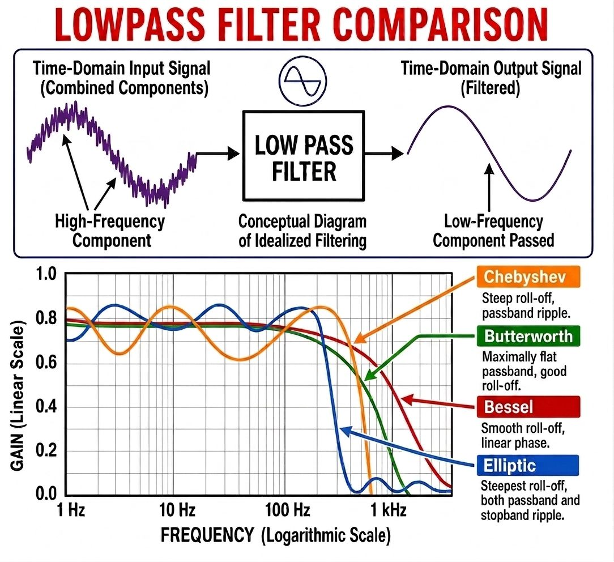


---

# Ecuación IIR

$$
y[n]
=
\sum_{k=0}^{M}b_kx[n-k]
-
\sum_{k=1}^{N}a_ky[n-k]
$$

## Infinite Impulse Response

<div class="threecols">

<div class="col">

#### Características:

- Recursivos 
- Feedback
- Polos y ceros
- Menor orden
</div>

<div class="col">


#### Ventajas IIR:

- Menor orden
- Más eficientes
- Menor memoria
- Diseño desde filtros analógicos
</div>

<div class="col">

#### Desventajas IIR

- Posible inestabilidad
- Fase no lineal
- Más sensibles numéricamente
</div>


---

# Familias IIR

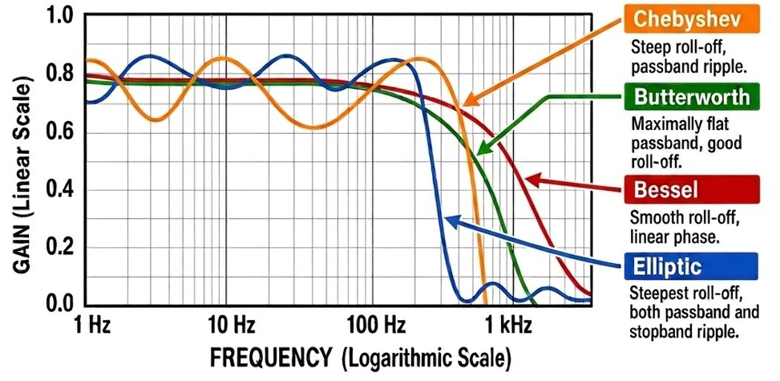

## Principales tipos

- Butterworth
- Chebyshev I
- Chebyshev II
- Elíptico
- Bessel

---

# Butterworth
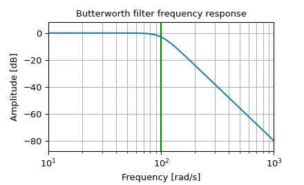
## Características

- Máximamente plano
- Sin ripple
- Respuesta suave

```python
b,a = butter(N, 
    Wn,   # puede ser par 
    btype='low', 
    output='ba', 
    fs=fs)
```


```python
y = lfilter(b,a,x)
y = filtfilt(b,a,x)
```

---

# Chebyshev Tipo I
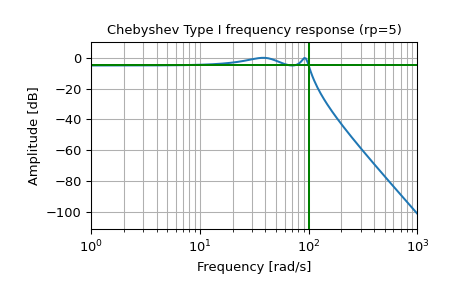
## Características

- Ripple en banda pasante
- Transición abrupta
- Menor orden

```python
b,a = cheby1(N, 
    rp, # ripple en db, rp=5 -> -5db
    Wn, # fc en unidades de fs
    btype='low', 
    output='ba', 
    fs=fs)

```
```python
y = lfilter(b,a,x)
y = filtfilt(b,a,x)
```

---

# Chebyshev Tipo II
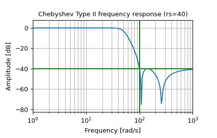
## Características

- Banda pasante plana
- Ripple en rechazo

```python
b,a = cheby2(N, 
    rp, # ripple en db, rp=5 -> -5db
    Wn, # fc en unidades de fs
    btype='low', 
    output='ba', 
    fs=fs)
```
```python
y = lfilter(b,a,x)
y = filtfilt(b,a,x)
```

---

# Filtros Elípticos
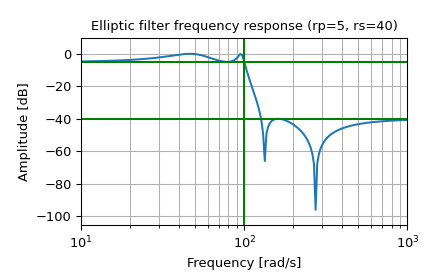
## Características

- Ripple en ambas bandas
- Máxima selectividad
- Orden mínimo

```python
b,a = ellip(N=4, #orden
    rp=5, # ripple en db, rp=5 -> -5db
    Wn=40, # rad/s
    btype='low', 
    output='ba', 
    analog=True)
```
```python
y = lfilter(b,a,x)
y = filtfilt(b,a,x)
```


---

# Comparación IIR

| Tipo | Ripple Passband | Ripple Stopband |
|---|---|---|
| Butterworth | No | No |
| Chebyshev I | Sí | No |
| Chebyshev II | No | Sí |
| Elíptico | Sí | Sí |

---
# Respuesta de filtros IIR en python

```python
# Butterworth High-pass @ 200 Hz
b_hp, a_hp = butter(order_iir, 200/nyq, btype='highpass', output='ba')

# Chebyshev I Band-pass 100-300 Hz (ripple 1 dB)
b_bp, a_bp = cheby1(order_iir, 1, [100/nyq, 300/nyq], btype='bandpass', output='ba')

# Elíptico Band-stop 100-300 Hz (ripple 1 dB, atenuación de rechazo 40 dB)
b_bs, a_bs = ellip(order_iir, 1, 40, [100/nyq, 300/nyq], btype='bandstop', output='ba')

# SOS (Second-Order Sections) para mayor estabilidad - Butterworth Band-stop
sos_bs = iirfilter(order_iir, [100/nyq, 300/nyq], btype='bandstop', ftype='butter', output='sos')

# Respuestas en frecuencia
w_hp, h_hp = freqz(b_hp, a_hp, worN=2048, fs=fs)
w_bp, h_bp = freqz(b_bp, a_bp, worN=2048, fs=fs)
w_bs, h_bs = freqz(b_bs, a_bs, worN=2048, fs=fs)
w_sos, h_sos = sosfreqz(sos_bs, worN=2048, fs=fs)

# Gráfica
plt.plot(w_hp, 20*np.log10(np.abs(h_hp)), label='Butter HP 200 Hz')
plt.plot(w_bp, 20*np.log10(np.abs(h_bp)), label='Cheby1 BP 100-300 Hz')
plt.plot(w_bs, 20*np.log10(np.abs(h_bs)), label='Ellip BS 100-300 Hz')
plt.plot(w_sos, 20*np.log10(np.abs(h_sos)), label='Butter BS SOS 100-300 Hz')
plt.title('Respuesta en frecuencia de filtros IIR')
plt.xlabel('Frecuencia [Hz]')
plt.ylabel('Magnitud [dB]')
plt.ylim(-80, 5)
plt.legend()
plt.grid(True)
plt.show()
```
---
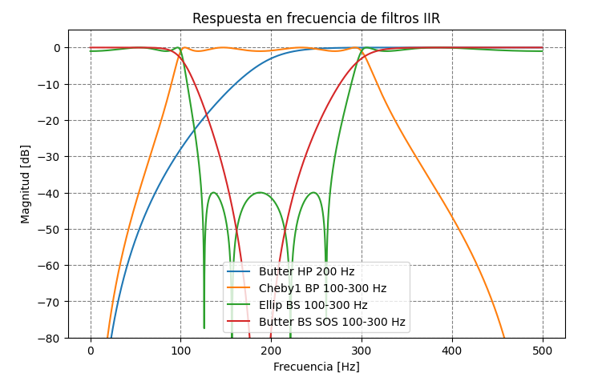

---

# Estabilidad

## Condición

$$
|p_k|<1
$$

Todos los polos deben estar dentro del círculo unidad.

---

# Biquads

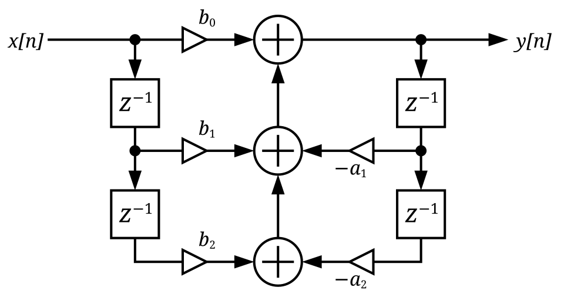

## Secciones de segundo orden

$$
H(z)=
\frac{
b_0+b_1z^{-1}+b_2z^{-2}
}{
1+a_1z^{-1}+a_2z^{-2}
}
$$

#### Direct Form I
- Más memoria

#### Direct Form II
- Menor memoria

---

# ¿Por qué usar biquads?

## Ventajas

- Mejor estabilidad numérica
- Implementación robusta
- Uso industrial estándar
- Ideal para DSP embebido

---
# Biquads en python

```python
sos = signal.butter(10, 15, 'hp', fs=1000, output='sos')
filtered = signal.sosfilt(sos, sig)
ax2.plot(t, filtered)
ax2.set_title('After 15 Hz high-pass filter')
ax2.axis([0, 1, -2, 2])
ax2.set_xlabel('Time [s]')
plt.tight_layout()
plt.show()

```
---
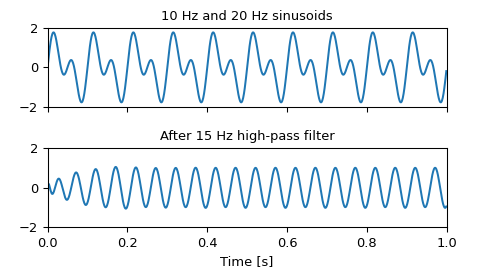
